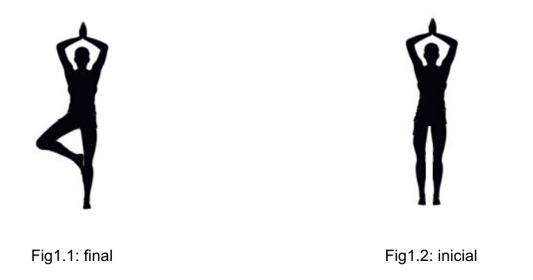

# **Prácticas 2015/ 2016**
### Nuevos Paradigmas Interacción

- Realizadas por :
  + Cristina Zuheros Montes
  + Miguel Sánchez Maldonado

## *Practica 1*
---------------
Detección de un movimiento de yoga con skeletonBasics de kinet.
El programa constará de un movimiento incial en el que se tienen los pies
relajados y las manos levantadas. El movimiento final será con las manos levantadas
levantar la pierna derecha. Para facilitar al usuario  el movimiento, apareceran
textos idicando lo que debe hacer y unas eferas indicando donde colocar las
articulaciones.

Para asegurar que el movimiento se hace correctamente y no por casualidad le pedimos
al usuario que se mantega en la posición un par de segundo(con ayuda de los frame).

## *Practica 2*
---------------
Creación de un juego de preguntas en las que el usuario tendrá que interaccionar a través de kinect para marcar la solución correcta.

El juego comenzará solicitando al usuario que elija un nivel de dificultad

y posteriormente elegir un tema de una lista de temas (hemos incorporado los siguientes temas: Arte, literatura, deporte, ciencias, historia y geografía)

Una vez elegido el tema y la dificultad, comenzarán las preguntas. Cada vez que nos aparece una pregunta el usuario debe pulsar una de las 3 posibles soluciones y al lado aparecerá un icono indicando si es la correcta o no. En caso de ser correcta el contador que muestra el resultado de aciertos se aumentará, después de cada pregunta el usuario debe pulsar el botón de siguiente pregunta que se activará al contestar la pregunta anterior. Después de cinco preguntas el programa vuelve a empezar y por tanto vuelve a pedir un nivel de dificultad, elegir un tema y vuelven a comenzar las preguntas.

